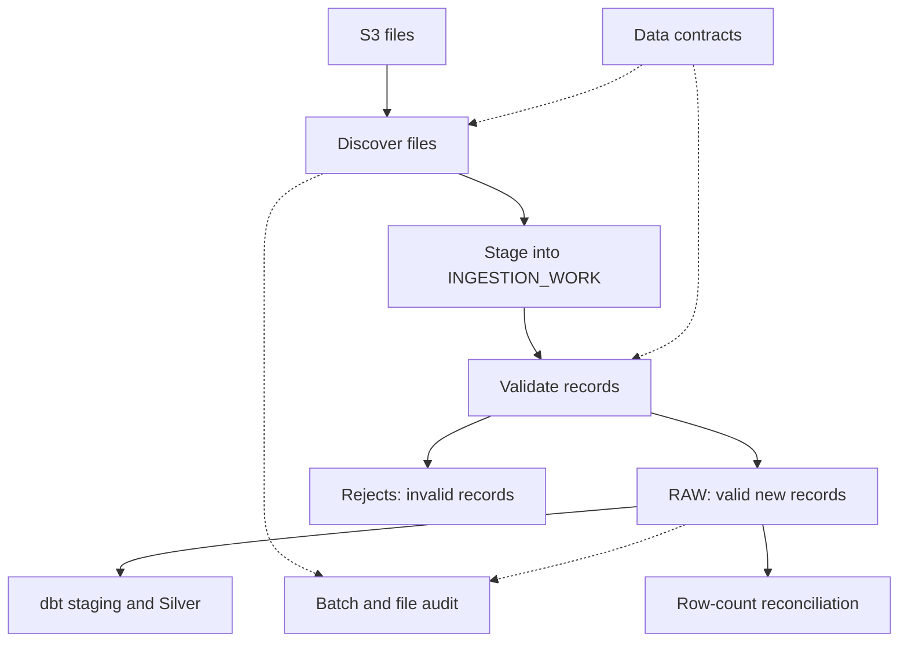

# Snowflake + dbt Mini Project

## Current implementation — verified through 4 September 2026

A three-entity data engineering prototype combining S3 file ingestion, a
metadata-driven Snowflake ingestion framework, and dbt staging and Silver
transformations. The framework discovers files, validates records against data
contracts, captures rejects, prevents repeat RAW inserts, reconciles row counts,
and records batch/file outcomes.

This section describes the tested implementation. The original seed-based
scaffold is preserved below for reference; its snapshots and marts are not
claimed as deployed or verified milestones.

### Data and architecture

| Entity | Source format | Original source rows | RAW target |
|---|---|---:|---|
| Customers | CSV | 1,000 | `DBT_MINI_PROJECT.RAW.RAW_CUSTOMERS` |
| Applications | JSON | 1,650 | `DBT_MINI_PROJECT.RAW.RAW_APPLICATIONS` |
| Payments | Parquet | 1,945 | `DBT_MINI_PROJECT.RAW.RAW_PAYMENTS` |

A retained positive customer test added one further RAW row. Do not assume the
whole Customers table still contains exactly 1,000 rows.



The external stage is
`DBT_MINI_PROJECT.DBT_MINI_DEV.S3_DBT_MINI_STAGE`.
`DBT_MINI_PROJECT` is the database; `DBT_MINI_DEV` is a schema.
The directory view exposes `FILE_CHECKSUM` and `FILE_LAST_MODIFIED`, rather than
the underlying directory column names `MD5` and `LAST_MODIFIED`.

RAW retains a VARIANT payload plus lineage fields such as ingestion record ID,
entity, record hash, file name, file row number, file content key, timestamps,
batch ID, run mode, and contract version. Record hashes support duplicate
detection; they do not replace business identifiers.

### Framework objects

| Object | Responsibility |
|---|---|
| `CONTROL.DATA_CONTRACT` | Active entity configuration, required fields and validation rules |
| `CONTROL.V_STAGE_FILE_DIRECTORY` | File discovery metadata |
| `INGESTION_WORK` | Parsed records, validation errors and processing status |
| `AUDIT.INGESTION_BATCH_AUDIT` | Batch lifecycle, file totals and row counts |
| `AUDIT.FILE_LOAD_AUDIT` | File identity, checksum, status and skip reason |
| `AUDIT.RECONCILIATION_RESULT` | Source versus accounted row totals |
| `REJECT.INGESTION_REJECT` | Invalid payloads, failed fields and resolution status |

### Five stored procedures

All procedures are in `DBT_MINI_PROJECT.PROCEDURES` and return VARIANT results.

| File in `sql/procedures/` | Procedure responsibility |
|---|---|
| `01_sp_discover_entity_files.sql` | Discover eligible files and apply file-level repeat-load checks |
| `02_sp_stage_selected_files.sql` | Parse one selected file into the work table |
| `03_sp_validate_work_batch.sql` | Apply contract rules and capture invalid records |
| `04_sp_load_validated_batch.sql` | Load valid new records, count duplicates and reconcile |
| `05_sp_run_entity_ingestion.sql` | Coordinate discovery, staging, validation and loading |

The wrapper accepts entity, run mode, force-reload flag and optional backfill
dates. The three middle batch-processing procedures each accept a batch ID.
Discovery uses the same five parameter types as the wrapper.

### Completed milestones

| Milestone | Evidence / outcome |
|---|---|
| S3 and Snowflake foundation | External stage, file formats and three RAW entity tables established |
| Initial RAW ingestion | Customers 1,000; Applications 1,650; Payments 1,945 |
| dbt staging | Three staging views and 40 tests passed in the recorded run |
| dbt Silver | Three incremental models and 33 tests passed in the recorded run |
| Framework metadata | Contracts, work, audit, reject and reconciliation objects created |
| Multi-format staging | CSV, JSON and Parquet files staged and validated |
| Record-level repeat protection | Existing records counted as duplicates, with zero new RAW inserts |
| Contract rejection test | Invalid customer captured with customer ID and email failures |
| Positive-load test | One valid new customer loaded and reconciled |
| Wrapper orchestration | End-to-end procedure executed successfully |
| Discovery repeat protection | Unchanged Customers file skipped before staging |
| No-work audit closure | Wrapper and batch audit both report SKIPPED, with end timestamp |
| Version control | Latest verified implementation commit `528cb01` pushed to feature branch |

Silver uses incremental merge on business keys with a three-day
`load_timestamp` lookback and `append_new_columns`. This is distinct from the
legacy scaffold's `updated_at` watermark described below. The recorded dbt runs
predate the latest audit-only fix; no fresh full dbt regression is claimed here.

### Verified tests

| Scenario | Expected and observed result |
|---|---|
| Customers repeat load | 1,000 source = 1,000 duplicates; 0 loaded; reconciliation PASSED |
| Applications repeat load | 1,650 source = 1,650 duplicates; 0 loaded; reconciliation PASSED |
| Payments repeat load | 1,945 source = 1,945 duplicates; 0 loaded; reconciliation PASSED |
| `TEST_NEW_CUSTOMER_20260831` | 1 source = 1 loaded; 0 rejected/duplicates; PASSED |
| `TEST_INVALID_CUSTOMERS_20260831` | 1 invalid work record and 1 open contract-validation reject |
| Final no-work run | 1 file discovered, 0 selected, 1 skipped; batch status SKIPPED and end timestamp populated |

Final no-work verification batch:
`ee176d91-97a2-44b3-969b-589b0b90caa0`.
The nested discovery result can remain `DISCOVERED`: it describes the child
step, while the wrapper and final batch audit describe the terminal outcome.
No-work discovery does not run row reconciliation, so a blank reconciliation
status is not a failed reconciliation.

Payments RAW checks returned 1,945 rows, 1,945 distinct ingestion IDs and 1,945
distinct payment IDs; zero missing hashes/content keys; zero missing required
fields detected by the current SQL; zero orphan payments; and zero payments
linked to non-approved applications.

| Payment business status | Rows |
|---|---:|
| COMPLETED | 1,515 |
| FAILED | 149 |
| PENDING | 217 |
| REFUNDED | 64 |

FAILED here is a payment business status, not an ingestion failure.
The Payments script does not yet establish valid dates, positive amounts,
blank-string handling or JSON-null handling.

The reconciliation rule is:

`source rows = loaded rows + rejected rows + duplicate rows`

The exported batch audit showed six COMPLETED batches with PASSED
reconciliation and matching arithmetic. Two older FAILED development batches
remain diagnostic history; their causes were not established from that export.
The invalid-customer unit test did not create a complete batch/file audit trail.

### Running and checking the current framework

Deploy the complete `CREATE OR REPLACE PROCEDURE` definition after changing a
procedure file. Calling an existing procedure does not deploy local changes.
The following call writes new audit records and can load newly eligible data;
it is not a read-only diagnostic.

```sql
CALL DBT_MINI_PROJECT.PROCEDURES.SP_RUN_ENTITY_INGESTION(
    'CUSTOMERS', 'INCREMENTAL', FALSE, NULL, NULL
);
```

Inspect the returned status and batch ID. A successful SQL CALL alone does not
prove pipeline success: the returned object can contain `FAILED`.
Use the returned batch ID in a read-only audit check:

```sql
SELECT batch_id, entity_name, batch_status,
       files_selected, files_skipped,
       source_row_count, loaded_row_count,
       rejected_row_count, duplicate_row_count,
       reconciliation_status, end_timestamp
FROM DBT_MINI_PROJECT.AUDIT.INGESTION_BATCH_AUDIT
WHERE batch_id = '<returned_batch_id>';
```

Existing validation files are in `sql/validation/`:

- `validate_raw_customers.sql`
- `validate_raw_applications.sql`
- `validate_raw_payments.sql`

`recover_stale_development_batch.sql` is a recovery utility, not a routine
read-only validation step. No `validate_ingestion_framework.sql` file has been
confirmed in the repository.

### Current limitations and next milestones

This is a tested development prototype, not a production-readiness claim.

- Staging supports exactly one selected file per entity batch. Multi-file
  iteration and aggregate batch accounting are future work.
- CSV field mapping is currently customer-specific; adding entities is not
  entirely configuration-only.
- Discovery can match prior file path OR checksum. Changed content at the same
  path needs an explicit policy and regression test to avoid unintended skips.
- Force reload at discovery does not mean duplicate RAW records will be inserted.
  Backfill and force-reload scenarios need dedicated end-to-end tests.
- Transaction boundaries, concurrent runs, within-file duplicates and interrupted
  retries require further hardening; exactly-once processing is not claimed.
- Null/malformed child results, missing/ambiguous contracts and unsupported rules
  need fail-closed handling and broader failure-path audit coverage.
- Required-field validation needs explicit JSON-null and blank-string coverage.
  Historical Customers accepted-status checks should be aligned with the active
  contract before treating them as the same rule set.
- The SKIPPED audit fix applies to new wrapper runs. It does not rewrite older
  DISCOVERED batches or comprehensively fix every failure-return path.
- Snowpipe, Airflow scheduling, automated CI/CD, alerting, SCD2 snapshots and Gold
  marts are not verified deliverables of this ingestion milestone.

Next: commit this documentation, prepare the feature-branch pull request,
expand regression coverage, and then develop the remaining modelling and
orchestration milestones. Review the existing scaffold before using its commands.

### Git checkpoint

Branch: `feature/metadata-ingestion-framework`.

| Commit | Milestone |
|---|---|
| `3f51843` | Ingestion framework foundation and file discovery |
| `c469606` | Staging, validation and idempotent RAW load procedures |
| `6dd513e` | Orchestration and discovery idempotency improvements |
| `528cb01` | SKIPPED batch audit fix and Payments validation |

Push of `528cb01` was confirmed. Merge into `main` has not been confirmed.
This README update is a subsequent documentation change, not part of that commit.

---

## Original scaffold reference — not the verified deployment runbook

The original content below is retained for historical context. Its seed-based
architecture, model inventory, expected schemas and demonstration instructions
must be checked against the current repository before use. Claims in this
section describe the scaffold, not additional verified project milestones.

An interview-ready lending analytics project built from three datasets:

- `customers` — customer master data
- `applications` — loan/application lifecycle data
- `payments` — payments made against approved applications

The project demonstrates staging, dimensional modelling, incremental loading, an SCD Type 2 snapshot, reusable macros, generic tests, a singular business-rule test, source freshness, and dbt documentation.

## Architecture

```text
CSV seeds / Snowflake RAW tables
        |
        v
STAGING views: stg_customers, stg_applications, stg_payments
        |
        +--> snapshot_customers (SCD Type 2 history)
        |
        v
MARTS: dim_customers, fct_applications, fct_payments
        |
        v
application_payment_summary
```

## Prerequisites

- Snowflake account
- Python 3.9+
- dbt Core with the Snowflake adapter

## 1. Create Snowflake objects

Run `setup/01_snowflake_setup.sql` as a role allowed to create a database, warehouse, role, and user. Replace the sample password before running it.

## 2. Create the Python environment

```bash
python -m venv .venv
source .venv/bin/activate          # Windows: .venv\Scripts\activate
pip install -r requirements.txt
```

## 3. Configure dbt

Copy `profiles.yml.example` to `~/.dbt/profiles.yml`, then set environment variables:

```bash
export SNOWFLAKE_ACCOUNT='your_account_identifier'
export SNOWFLAKE_USER='DBT_USER'
export SNOWFLAKE_PASSWORD='your_password'
```

Windows PowerShell:

```powershell
$env:SNOWFLAKE_ACCOUNT='your_account_identifier'
$env:SNOWFLAKE_USER='DBT_USER'
$env:SNOWFLAKE_PASSWORD='your_password'
```

Validate connectivity:

```bash
dbt debug
```

## 4. Run the project

```bash
dbt deps
dbt seed --full-refresh
dbt snapshot
dbt build
```

`dbt build` creates models and executes their tests in dependency order. To inspect lineage and descriptions:

```bash
dbt docs generate
dbt docs serve
```

## Expected schemas

| Schema | Objects | Purpose |
|---|---|---|
| `DBT_MINI_DEV` | three seed tables | Demo raw input |
| `DBT_MINI_DEV_STAGING` | three views | Clean names, types and values |
| `DBT_MINI_DEV_SNAPSHOTS` | customer snapshot | SCD Type 2 history |
| `DBT_MINI_DEV_MARTS` | dimensions, facts and summary | Analytics-ready layer |

## Models

| Model | Materialization | Grain |
|---|---|---|
| `stg_customers` | view | one row per customer |
| `stg_applications` | view | one row per application |
| `stg_payments` | view | one row per payment |
| `dim_customers` | table | one current row per customer |
| `fct_applications` | incremental | one row per application |
| `fct_payments` | incremental | one row per payment |
| `application_payment_summary` | table | one row per application |

## Incremental behaviour

The fact models use `updated_at` as a watermark and `merge` with a unique key. Re-running `dbt build` is idempotent. In production, include a small lookback window to safely handle late-arriving records.

## Suggested demonstration

1. Run the full project and show the DAG using dbt docs.
2. Change a customer's city or status in Snowflake.
3. Run `dbt snapshot` again and query the snapshot to show the old and current versions.
4. Add a new payment row, rerun `dbt build`, and explain the incremental merge.
5. Temporarily add an invalid payment amount and show the custom test failing.

## Production improvements

- Replace seeds with ingestion-managed RAW tables and define dbt sources with freshness metadata.
- Use separate DEV, TEST, and PROD targets and CI state comparison (`dbt build --select state:modified+`).
- Add orchestration through Airflow or dbt Cloud, alerting, query tags, role separation, and resource monitors.
- Add reconciliation checks between source counts/amounts and gold outputs.
- Store credentials in a secrets manager; never commit them.
